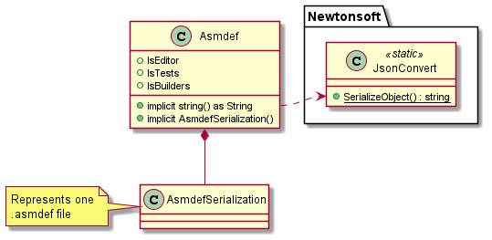
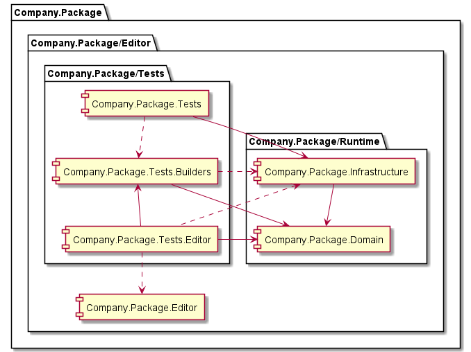

## Package layout creation

It relays on a simple Editor script to create a whole folder hierarchy,
which follows [official Unity Package Layout](https://docs.unity3d.com/Manual/cus-layout.html)
as well as a customized set of dependencies, asmdefs and so forth.

### Asmdef structure model


### Unity package layout model

Proposed [by Unity](https://docs.unity3d.com/Manual/cus-layout.html):
```
<root>
  ├── package.json
  ├── README.md
  ├── CHANGELOG.md
  ├── LICENSE.md
  ├── Third Party Notices.md
  ├── Editor
  │   ├── Unity.[YourPackageName].Editor.asmdef
  │   └── EditorExample.cs
  ├── Runtime
  │   ├── Unity.[YourPackageName].asmdef
  │   └── RuntimeExample.cs
  ├── Tests
  │   ├── Editor
  │   │   ├── Unity.[YourPackageName].Editor.Tests.asmdef
  │   │   └── EditorExampleTest.cs
  │   └── Runtime
  │        ├── Unity.[YourPackageName].Tests.asmdef
  │        └── RuntimeExampleTest.cs
  ├── Samples~
  │        ├── SampleFolder1
  │        ├── SampleFolder2
  │        └── ...
  └── Documentation~
       └── [YourPackageName].md
```

---

Some premises:

- Any architecture layers' hierarchy lays on `Runtime` folder.
- ``<root>`` is Package layout folder — meant as package name.
- `Tests` folder also contains a `Builders` one if builders are required.
- `Test/Editor` asmdef does not switch for `Editor.Tests` in its name.
- Unit testing asmdef, the editor one, couples with any layer of the architecture.
  - *It is, one unit testing asmdef to test them (layers) all.* 💍
- Scene testing asdmef, the runtime one, may or may not depends on domain layers.
- Creator just creates architecture-related and documentation folders.
- Any asmdef is created alongside an `AssemblyInfo.cs` file.

Then, concerning architecture matters.  
Lets a simple layered-architecture with ``Domain`` and ``Infrastructure``.

Having the following tags:
- 📁: Contains asmdef file.
  - 🔧: Any contained asmdef is just editor.
- ❌: Is **ignored** as part of the name.
- ⚫: Is a dependency for 🖤 (linked by color).
- 🖤: Depends on ⚫ (linked by color).
- { }: Optional.

This is an example of how the created package layout would end:
```
[Company.Package]
  ├── 🟤Editor📁🔧
  ├── Runtime❌ 
  │   ├── 🟠Domain📁
  │   └── 🟡Infrastructure📁🧡
  ├── Tests 🔧
  │   ├── 🟣Builders📁🧡{💛}
  │   ├── Editor📁🧡💜{🤎}{💛}
  │   └── Runtime📁💛{💜}{🧡}
  └── Documentation~
```

Expressed as an architecture with complete package names (where any discontinuous relation stands for optional and groups are folders w/o asmdef):



Any tests component aforementioned might know of package-level visibility members on its known components.

To sum up,
- **Editor tests mostly stands for unit testing**, despite it's also needed for Editor/Inspector testing or so,
- while **Runtime (scene) tests meaning any other tests suite**, from integration to acceptance if needed.  
